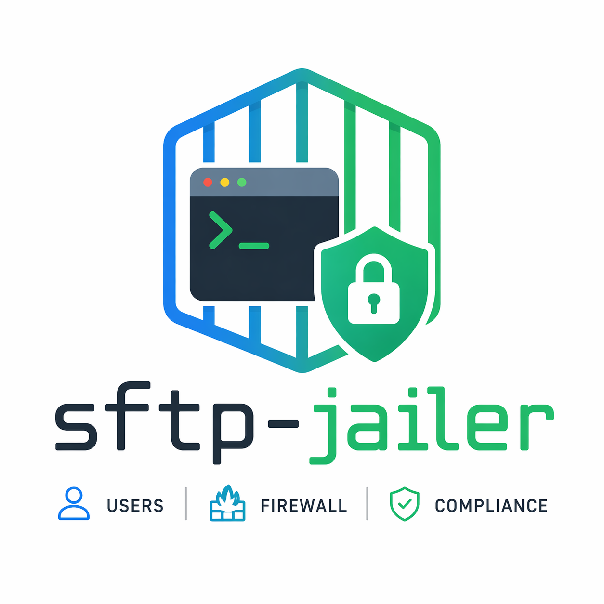

<p align="center">
  
</p>

<h1 align="center">sftp-jailer</h1>

<p align="center">
  <em>Chrooted SFTP administration for Ubuntu 24.04, in one TUI.</em>
  <br>
  <a href="https://sftp-jailer.com">sftp-jailer.com</a>
</p>

---

> **Status:** Pre-alpha. Phase 1 (foundation + diagnostic + TUI shell) in progress.

## Install

_`.deb` packaging arrives in Phase 5. Early preview:_

```bash
# Build from source. Requires Go 1.25+.
# DO NOT `apt install golang-go` on Ubuntu 24.04 — that ships Go 1.22.2, which cannot build this project.
# Use either:
#   • the longsleep PPA: sudo add-apt-repository ppa:longsleep/golang-backports && sudo apt install golang-1.25
#   • or the official tarball from https://go.dev/dl/

go install github.com/sftp-jailer-dev/sftp-jailer/cmd/sftp-jailer@latest
sudo sftp-jailer doctor
```

## Platform

Ubuntu 24.04 LTS only for v1. `apt`, `systemd` (journald + timers), `ufw` (nftables backend) assumed present.

## License

GPL-3.0. See [LICENSE](./LICENSE).
